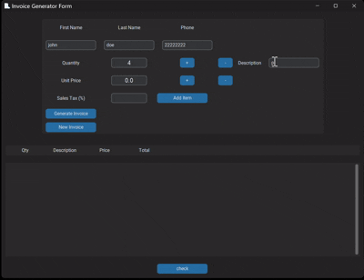
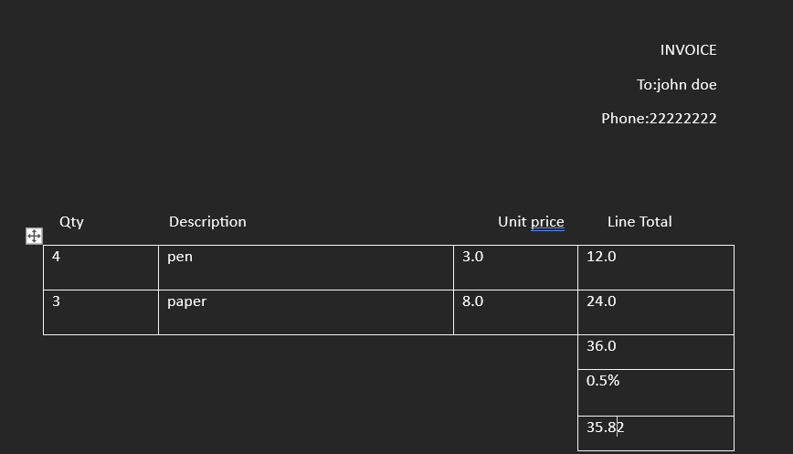

# 🧾 Invoice Generator Form

A dynamic, user-friendly invoice generator built with **CustomTkinter**, **python-docx**, and **Pillow**! Create professional invoices in DOCX format with ease. 🎉



---

## 🌟 Features

- **🖼️ Logo Integration**: Automatically loads and displays your company logo from `logo.png`.
- **👤 Customer Details**: Input first name, last name, and phone number (validated to 10 digits).
- **🔢 Itemized List**: Add multiple items with Quantity, Description, and Unit Price. Calculate line totals automatically.
- **➕ Increment/Decrement Controls**: Adjust Quantity and Price using `+` / `-` buttons without typing.
- **📜 Sales Tax**: Apply a custom sales tax percentage to the subtotal.
- **📋 Scrollable Table**: View all line items in a neat, scrollable table.
- **📝 Docx Rendering**: Uses `docxtpl` to populate a DOCX template and save with a timestamped filename.

- **🔔 User Feedback**: Interactive pop-ups (`CTkMessagebox`) for success and error notifications.

---

## 🚀 Quick Start

1. **Install Dependencies**
   ```bash
   pip install customtkinter python-docx Pillow
   ```

2. **Prepare Assets**
   ```bash
   ├── logo.png                # Your company logo
   ├── invoice_template.docx   # Docx template with placeholders: {{ name }}, {{ phone }}, {{ invoice_list }}, {{ subtotal }}, {{ salestax }}, {{ total }}
   └── main.py                 # Invoice generator script
   ```

3. **Run the App**
   ```bash
   python main.py
   ```

4. **Generate Invoice**
   - Fill in customer details and items.
   - Click **Generate Invoice** to produce a `.docx` file in the working directory.

---

## 🖥️ Code Breakdown

### Input Validation
```python
entry_var.trace_add("write", validate_input)
phone_entry.bind("<KeyRelease>", limit_phone_entry)
```
- Resets invalid numeric entries to `0`.
- Limits phone input to 10 digits.

### Item Management
```python
def add_item():
    qty = int(qty_entry.get())
    desc = desc_entry.get()
    price = float(price_entry.get())
    line_total = qty * price
    invoice_list.append([qty, desc, price, line_total])
    add_row(invoice_item)
```
- Validates positive quantity, price, and non-empty description.
- Updates scrollable table with new row.

### Invoice Generation
```python
def generate_invoice():
    doc = DocxTemplate(template_path)
    doc.render({"name": name, "phone": phone, "invoice_list": invoice_list, "subtotal": subtotal, "salestax": tax_str, "total": total})
    doc.save(output_filename)
```
- Renders context into a Word template and saves with timestamp.

---

## 🎨 Template Placeholders
Make sure your `invoice_template.docx` includes these placeholders:  
```
{{ name }}
{{ phone }}

  - {{ item[0] }} x {{ item[1] }} @ {{ item[2] }}: {{ item[3] }}

Subtotal: {{ subtotal }}
Sales Tax: {{ salestax }}
Total: {{ total }}
```

---

## 🌱 Customization

- **File Naming**: Modify the `doc_name` format to include invoice numbers or client IDs.
- **Template Styling**: Use Word’s styling features to brand your invoice template.
- **Export Formats**: Extend to PDF using `python-docx` + `docx2pdf` or other libraries.

---

## 📬 Feedback & Contributions

Built with ❤️ by **Arshia Saberian**. Found an issue or have a feature request? Open an issue or pull request! 🚀

---

**Generate invoices effortlessly and enhance your billing workflow!**

